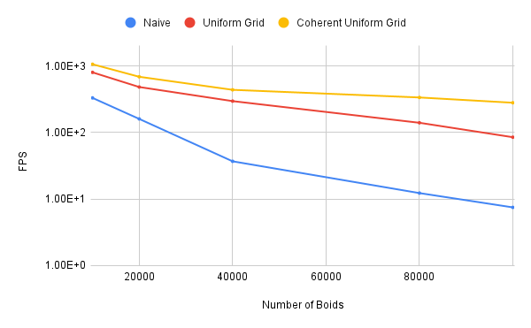
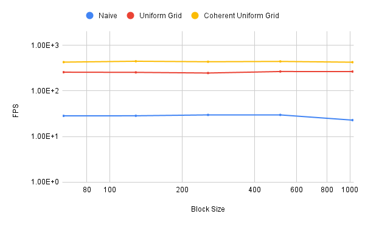

**University of Pennsylvania, CIS 5650: GPU Programming and Architecture,
Project 1 - Flocking**

## CUDA Flocking Simulation
This project is a CUDA-based boids flocking simulation. 

It provides 3 different implementations based on different spatial optimizations:
- Naive Implementation
- Uniform Grids
- Coherent Uniform Grids

## Performance Analysis

All the results below were tested on: Windows 10, i7-7700 @ 3.60GHz 16GB, GTX 1080 8GB

### Performance Over Boid Count (No Visualization)

### Performance Over Boid Count (With Visualization)
.png))

We can see as the boid number increases, FPS of all the methods decrease. Since the naive method has the O(n2) complexity, the FPS decreases significantly as the boid number increases. In contract, the other 2 methods are doing a better job here.

As we normally expected, the FPS decreases as the boid number raises, since when there're more boids in the scene, there will be more computations to be done. At the same time, more warps need to be dispatch and calculate. Also note that when we disable the visualization, the FPS will be slightly improved since we can get rid of drawing cost.

### Performance Over Block Size (No Visualization)

Note: The boid number is fixed at 50000

### Performance over Block Size (With Visualization)
.png)

Note: The boid number is fixed at 50000

For the block size changes, there's no significant impact on the performance. Overall, block size = 512 seems to have a slightly greater performance than other sizes, and I would guess it is the sweet point of the utilization of the single SM usage and the GPU efficient occupancy and scheduling.

### Performance over Checking Different Number of Neighboring Cells

Note: This is measured under
- coherent grid method
- no visualization

When the number of boids is smaller, the 27 neighbors and 8 neighbors method give a similar FPS result. And as the boid count grows, the 27 neighbors method gives a better performance, especially when the boid number is at about 40000. I believe it is caused by the spatial locality, since we are using the coherent grid method, we sort the array by the grid index, in this case, when we have more grid cells, we're checking the boids more sequenctially. This leads to the better cache usage.
